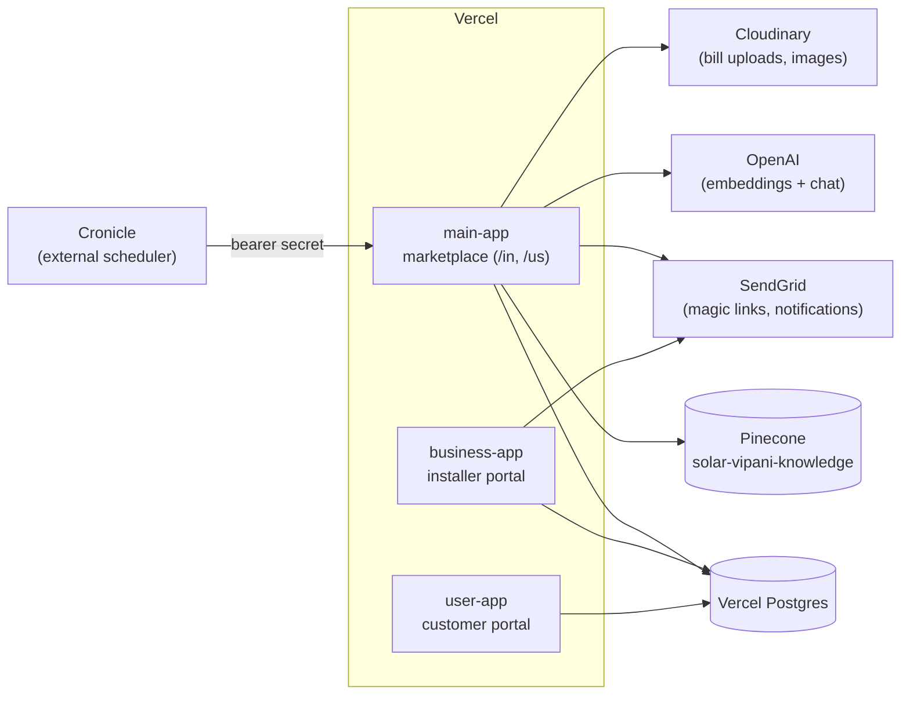

# Architecture

How Solar Vipani is built, and why. This documents the system as it runs in production at [solarvipani.com](https://solarvipani.com), including the trade-offs behind the less obvious decisions.

## System overview

Three SvelteKit apps deployed independently on Vercel out of one npm-workspaces monorepo, all sharing a single Postgres database:

| App | Role |
|-----|------|
| `main-app` | Public marketplace. Serves both regions as path-prefixed routes (`/in`, `/us`), each with its own components, content, and chatbot endpoint. Also hosts the privileged internal API and cron endpoints. |
| `business-app` | Portal where installers manage listings, leads, and proposals. Region-split internally like main-app. Live at [business.solarvipani.com](https://business.solarvipani.com). |
| `user-app` | Customer account portal for tracking quotes and installations. Live at [user.solarvipani.com](https://user.solarvipani.com). |

Security headers (HSTS, `X-Frame-Options: DENY`, nosniff, referrer policy) are applied platform-wide via `vercel.json` rather than in app code.

## Data layer

- **Vercel Postgres** accessed through a shared connection pool (`src/lib/server/db.ts`); queries are plain parameterized SQL in `queries.ts` — no ORM. The domain is small enough that an ORM would add more ceremony than safety.
- **Versioned SQL migrations** (`src/lib/server/migrations/`) carry not just schema but *content*: the programmatic SEO pages (rooftop solar guides, panel comparisons, city clusters) ship as numbered, reviewable SQL files. This keeps thousands of content rows in git history instead of an opaque CMS.
- Key tables: `locations` and `businesses_1` / `us_businesses` (installer listings per region), `leaddata` (quote requests, with lifecycle category: unclaimed vs claimed), and `embeddings.in_embedding_index` (the RAG bookkeeping table, below).

## RAG chatbot pipeline

The chatbot answers sizing/subsidy/pricing questions grounded in site content. It is two pipelines: an offline indexing path and an online answer path.

### Offline: keeping the index current

1. **`sync-embedding-index.js`** treats the live sitemap (`/in/sitemap.xml`) as the single source of truth — it only lists pages that actually resolve, in canonical URL form. Each sitemap URL is classified by shape into a category (currently `city-pages`) that assigns a `chunking_strategy`, and is upserted into `embeddings.in_embedding_index`. The sync is deliberately **non-destructive**: it inserts and refreshes, never deletes, and never touches `last_embedding_update` — that column is owned by the downstream job, so the two jobs can't race each other.
2. **`embed-city-pages.js`** picks up rows whose content is newer than their last embedding, chunks pages per their strategy, embeds with `text-embedding-3-small`, and writes vectors to the Pinecone index `solar-vipani-knowledge` with `title` and `source_url` metadata.

### Online: answering a message

1. **Query condensation.** Follow-up messages ("and for a shop?") are useless as retrieval queries. When history exists, a small model rewrites the latest message into a standalone search query using the conversation only to resolve references — it is explicitly instructed not to answer.
2. **Retrieval with a relevance bar.** The condensed query is embedded and Pinecone returns a wider candidate set (top-6), which is then filtered by a cosine-similarity threshold (0.65, tuned for `text-embedding-3-small`). Feeding loosely-related context to the model on off-topic questions is what invites confident hallucination; below the bar, the model is told the knowledge base has nothing relevant.
3. **Deterministic citations.** Source links shown to the user are derived from retrieval metadata — deduped by `source_url`, capped at 3 — never generated by the model, because LLMs mangle URLs.
4. **Streaming answer + guided-flow handoff.** The response streams to the client. When the message shows quote intent (sizing, pricing, subsidy, bill-amount keywords), the model appends a marker (`SUGGEST_GUIDED_FLOW`) that the UI turns into an offer to enter a structured lead-qualification flow — the chatbot funnels into the marketplace rather than dead-ending in chat.

Conversation history is defensively capped (last 8 turns) and sanitized before use.

## Authentication

Both portals are **passwordless** — customers and installers sign in via emailed magic links.

- Tokens are random UUIDs, stored **hashed (SHA-256) at rest** with a 15-day expiry. A leaked database dump does not yield working sign-in links.
- Each account holds a single token column, so minting a new link **invalidates the previous one** (last-write-wins). Trade-off accepted deliberately: a user who requests two links and clicks the older email gets a dead link, in exchange for a strictly smaller live-token surface.
- Token-minting endpoints are privileged: they are guarded by a shared internal secret (`x-internal-secret`) compared with `timingSafeEqual`, and **fail closed** — if the secret is unset (misconfiguration), the guard rejects everything rather than letting requests through. Only server-side flows (welcome mail, lead-confirmation mail) can mint links, via `event.fetch` forwarding the header.

## PII & compliance

Handling homeowner contact details and electricity bills means PII discipline is built into the product, not bolted on:

- **Consent** capture on analytics (PostHog) and lead submission, with public **DSAR routes** (`/in/data-access`, `/in/data-deletion`) for access and erasure requests.
- **Bill uploads are private** Cloudinary assets, not public URLs.
- **6-month retention purge**: an external Cronicle job POSTs to `/api/cron/purge-old-leads` with a bearer secret. Only *unclaimed* leads are purged — claimed leads belong to the installer actively working them. The endpoint returns the Cloudinary IDs of deleted leads' bills and removes those files too, with an extended function `maxDuration` as headroom for batches with many attachments. Retention is enforced by machinery, not policy documents.

## Programmatic SEO

Region → state → district → city pages are generated from Postgres (installer counts, local content) with a slug resolver mapping URL segments to canonical entities, and per-region `sitemap.xml` endpoints generated from the same data. Because the sitemap is derived from what actually resolves, it doubles as the contract for the RAG indexing pipeline above.

## Failure modes considered

- **Chatbot with no relevant knowledge** → threshold filter empties the context and the model is told so, rather than improvising from weak matches.
- **Missing internal secret** → auth guard fails closed; magic-link minting becomes unreachable instead of unauthenticated.
- **Purge batch with many bill attachments** → extended serverless duration; Cloudinary cleanup is driven by the SQL `RETURNING` clause so files and rows can't silently diverge.
- **Embedding sync racing the embedding job** → column ownership is split (`last_update` vs `last_embedding_update`) so each job writes only what it owns.
- **Stale sitemap entries** → sync never deletes; orphaned index rows age out of retrieval naturally via the relevance threshold rather than breaking the pipeline.
